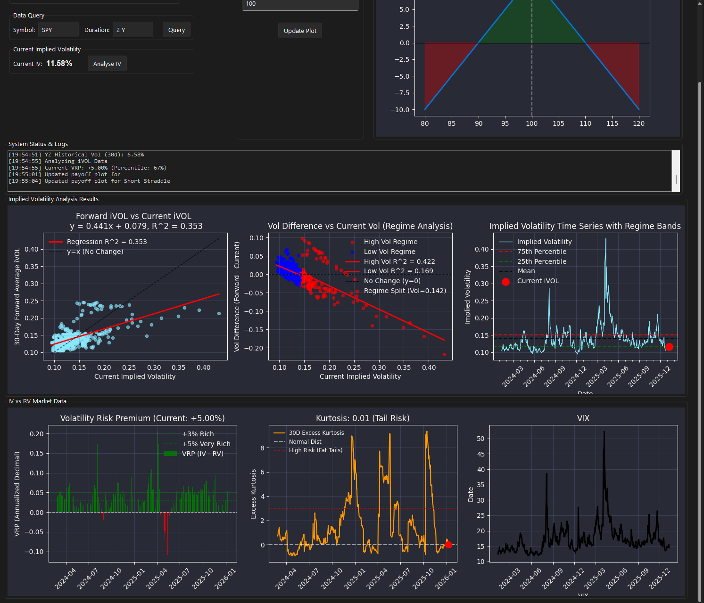

# Options-Volatility-Analyzer

## Features
* **Implied Volatility Analysis:** Regime analysis and forward vs. current iVOL tracking.
* **Risk Metrics:** Real-time Volatility Risk Premium (VRP) and Tail Risk (Kurtosis) monitoring.
* **Market Data:** Live VIX tracking and historical time series with regime bands.
* **Payoff Visualization:** Visual representation of strategy outcomes (e.g., Short Straddles) relative to price movement.

## 🛠 Future Roadmap
* **Hidden Markov Models (HMM):** Implementing HMMs to better model regime shifts in latent space, allowing for more robust detection of transitions between high and low volatility states, which can influence strategy decision-making

* **Option Strategy Payoffs:** Integration of real-time/ historical option chain data to provide analysis of Options Greeks and payoff diagrams for multi-leg strategies.